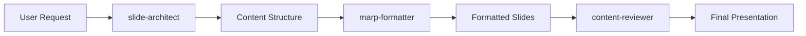

<!-- _class: lead -->
# Claude Code Subagents for Marp Presentations

## Automated Slide Generation Template System

### Demo Presentation
### Showcasing the Power of AI-Assisted Presentation Creation

---

## What We Built Today

### Complete Template System

- **3 Specialized Subagents** for different aspects of presentation creation
- **3 Professional Templates** for various presentation types
- **Custom Styling** with responsive CSS theme
- **Comprehensive Workflow** from concept to finished slides

<div class="demo-box">

**Result**: A production-ready system for creating professional Marp presentations using Claude Code's subagent architecture.

</div>

---

## The Subagent Architecture

### Specialized AI Assistants

<div class="workflow-step">

**slide-architect.md** - Presentation Structure Expert
- Designs logical slide sequences and content flow
- Creates compelling narrative arcs and transitions
- Optimizes content organization for audience engagement

</div>

<div class="workflow-step">

**marp-formatter.md** - Marp Syntax Specialist  
- Handles frontmatter configuration and theme setup
- Converts content to proper Marp markdown format
- Ensures cross-format compatibility (PDF, HTML, PowerPoint)

</div>

<div class="workflow-step">

**content-reviewer.md** - Quality Assurance Expert
- Reviews presentations for clarity and effectiveness
- Checks consistency, grammar, and visual design
- Provides actionable feedback for improvement

</div>

---

## Template Library Overview

### Three Professional Templates

| Template | Purpose | Key Features |
|----------|---------|--------------|
| **Basic Presentation** | General purpose | Clean design, flexible structure, speaker notes |
| **Tech Talk** | Technical conferences | Code highlighting, dark theme, demo sections |
| **Corporate** | Business meetings | Executive styling, metrics cards, ROI focus |

### Each Template Includes
- Pre-configured frontmatter with professional styling
- Structured slide sequences for optimal flow
- Custom CSS classes for enhanced visual appeal
- Speaker notes templates for preparation guidance

---

## Workflow Demonstration

### From Concept to Finished Slides



### Example Workflow

1. **User**: "Create a presentation about our new API"
2. **slide-architect**: Designs structure with intro, features, demo, Q&A
3. **marp-formatter**: Converts to tech-talk template with proper syntax
4. **content-reviewer**: Reviews for technical accuracy and clarity
5. **Result**: Professional presentation ready for export

---

## Key Features Demonstrated

### Advanced Marp Capabilities

<div class="demo-box">

**Frontmatter Configuration**
```yaml
---
marp: true
theme: gaia
paginate: true
style: |
  section { /* Custom CSS */ }
---
```

</div>

### Professional Styling
- Responsive design for different screen sizes
- Print-optimized CSS for PDF export
- Custom color schemes and typography
- Grid layouts and component libraries

### Interactive Elements
- Speaker notes for presentation guidance
- Code syntax highlighting
- Custom CSS classes for special content
- Animation and transition support

---

## Template Showcase: Tech Talk

### Designed for Technical Presentations

```python
class APIClient:
    def __init__(self, base_url, api_key):
        self.base_url = base_url
        self.headers = {'Authorization': f'Bearer {api_key}'}
    
    async def fetch_data(self, endpoint):
        async with aiohttp.ClientSession() as session:
            async with session.get(
                f"{self.base_url}/{endpoint}", 
                headers=self.headers
            ) as response:
                return await response.json()
```

**Features**: Dark theme, syntax highlighting, performance metrics, demo sections

---

## Template Showcase: Corporate

### Executive-Ready Business Presentations

<div class="grid-3">
  <div class="metric-card">
    <div class="metric-number">25%</div>
    <div class="metric-label">Revenue Growth</div>
  </div>
  <div class="metric-card">
    <div class="metric-number">$2.5M</div>
    <div class="metric-label">Investment</div>
  </div>
  <div class="metric-card">
    <div class="metric-number">340%</div>
    <div class="metric-label">ROI</div>
  </div>
</div>

**Features**: Professional styling, financial metrics, strategic frameworks, executive summaries

---

## Benefits of This Approach

### For Developers

- **Consistency**: Standardized presentation formats across teams
- **Efficiency**: Rapid slide creation with AI assistance  
- **Quality**: Built-in review and optimization processes
- **Flexibility**: Customizable templates for different needs

### For Organizations

- **Brand Compliance**: Consistent visual identity
- **Time Savings**: Reduced presentation preparation time
- **Professional Quality**: Expert-level design and content
- **Scalability**: Template system grows with organization

---

## Getting Started

### Quick Setup

```bash
# Clone or download the template system
git clone https://github.com/your-repo/marp-slidegen

# Navigate to project directory
cd marp-slidegen

# Start with a template
cp templates/basic-presentation.md my-presentation.md
```

### Using the Subagents

```bash
# In Claude Code, invoke the subagents
"Use the slide-architect to plan my quarterly review presentation"
"Use the marp-formatter to convert this content to Marp format"  
"Use the content-reviewer to improve this presentation"
```

---

## Advanced Customization

### Custom Themes

```css
/* Add to themes/custom-theme.css */
.company-brand {
    background: linear-gradient(135deg, #your-color1, #your-color2);
    border-left: 4px solid #your-accent;
    padding: 20px;
    border-radius: 8px;
}
```

### Template Modification

- Modify frontmatter for different themes and configurations
- Add custom CSS classes for specific styling needs
- Create new templates for specialized presentation types
- Integrate with existing design systems and brand guidelines

---

## Export and Deployment

### Multiple Output Formats

```bash
# Using Marp CLI
marp presentation.md --pdf
marp presentation.md --html
marp presentation.md --pptx

# Using VS Code Extension
# Ctrl+Shift+P → "Marp: Export Slide Deck"
```

### Integration Options

- **GitHub Actions**: Automated slide generation and deployment
- **CI/CD Pipelines**: Integration with development workflows
- **Content Management**: Version control for presentation assets
- **Team Sharing**: Collaborative editing and review processes

---

## Best Practices Learned

### Content Strategy

- **One Idea Per Slide**: Maintain focus and clarity
- **Visual Hierarchy**: Use headings and styling consistently
- **Audience First**: Tailor content and complexity to audience needs
- **Story Arc**: Create compelling narrative flow

### Technical Implementation

- **Version Control**: Track presentation changes with Git
- **Modular Design**: Reusable components and templates
- **Performance**: Optimize images and CSS for fast loading
- **Accessibility**: Ensure presentations work for all users

---

## Future Enhancements

### Planned Features

- **Interactive Presentations**: Add polls, quizzes, and audience engagement
- **Dynamic Content**: Integration with APIs for real-time data
- **Multi-language Support**: Internationalization capabilities
- **Advanced Analytics**: Presentation performance tracking

### Community Contributions

- **Template Library**: Expand collection of specialized templates
- **Theme Gallery**: Community-contributed visual themes
- **Plugin System**: Extensible functionality for custom needs
- **Best Practices Guide**: Comprehensive documentation and tutorials

---

## Call to Action

### Try It Yourself

1. **Download** the template system from the repository
2. **Experiment** with different templates and subagents
3. **Customize** themes and styling for your brand
4. **Share** your improvements with the community

### Get Involved

- **GitHub Repository**: Contribute templates, themes, and improvements
- **Community Forum**: Share experiences and get help
- **Documentation**: Help improve guides and tutorials
- **Feedback**: Report issues and suggest new features

---

<!-- _class: lead -->
# Thank You!

## Questions & Discussion

### Let's explore the possibilities together

**Repository**: `github.com/your-username/marp-slidegen`
**Documentation**: `docs.yoursite.com/marp-templates`
**Community**: `discord.gg/your-community`

---

## Appendix: Template Comparison

### Feature Matrix

| Feature | Basic | Tech Talk | Corporate |
|---------|-------|-----------|-----------|
| Professional Styling | ✅ | ✅ | ✅ |
| Code Highlighting | ⚠️ | ✅ | ❌ |
| Metrics Display | ❌ | ⚠️ | ✅ |
| Dark Theme | ❌ | ✅ | ❌ |
| Executive Summary | ⚠️ | ❌ | ✅ |
| Speaker Notes | ✅ | ✅ | ✅ |
| Custom Components | ⚠️ | ✅ | ✅ |

**Legend**: ✅ Full Support | ⚠️ Partial Support | ❌ Not Included

---

<!-- Speaker Notes for Demo Presentation

Slide 1 (Title):
- Welcome audience and introduce the demo
- Explain this presentation was created using the system we built
- Set expectations for what they'll see

Slide 2 (What We Built):
- Emphasize the completeness of the solution
- Highlight the AI-assisted approach
- Connect to modern development practices

Slide 3 (Subagent Architecture):
- Explain the division of responsibilities
- Show how each agent specializes in one area
- Demonstrate the collaborative workflow

Continue with detailed speaker notes...

Demo Presentation Tips:
- Use this presentation to showcase the system's capabilities
- Point out specific Marp features as you present
- Be prepared to switch between slides and code
- Have the repository ready to show during Q&A
- Demonstrate live editing if possible

-->