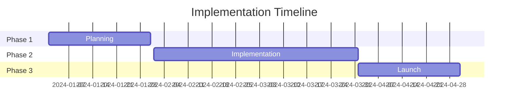

# Your Presentation Title

## Engaging Subtitle That Captures Attention

### Your Name | Your Title
#### Organization Name | Date

---
layout: default
---

# Agenda

## What We'll Cover

- **Introduction** - Setting the context
- **Problem/Opportunity** - What we're addressing  
- **Solution/Approach** - Our proposed path forward

## Next Steps

- **Benefits** - Why this matters
- **Next Steps** - What happens now
- **Q&A** - Your questions and discussion

<strong>Key Point:</strong> Set clear expectations and engage your audience from the start.

---
layout: section
background: '#f8fafc'
---

# Introduction

---
layout: default
---

# Welcome and Context

## Welcome
- Brief welcome to audience
- Purpose of this presentation

## Objectives
- What we'll accomplish together
- Any housekeeping items

<h3 class="text-xl font-semibold text-blue-800 mb-2">💡 Key Point</h3>

Set clear expectations and engage your audience from the start.

---
layout: section
background: '#fee2e2'
---

# Problem/Opportunity

---
layout: two-cols
---

# Current Situation

- Describe the current state
- Identify key challenges or opportunities

- Use specific examples or data points
- Connect to audience's experience

::right::

# Why This Matters

- Impact on stakeholders
- Cost of inaction

- Opportunity for improvement
- Alignment with organizational goals

---
layout: section
background: '#ecfdf5'
---

# Solution/Approach

---
layout: image-right
image: https://source.unsplash.com/800x600/?solution,strategy
---

# Our Recommendation

## Core Solution
- Clear, concise solution statement
- Key components or phases

## Advantages
- How it addresses the problem
- Unique advantages or differentiators

---
layout: default
---

# Implementation Overview

## Approach

- High-level approach
- Key milestones or phases

- Resource requirements
- Timeline considerations

## Timeline

---
layout: section
background: '#f0fdf4'
---

# Benefits

---
layout: two-cols
---

# Expected Outcomes

## Quantitative Benefits

- 📈 Measurable improvements
- 💰 Cost savings or revenue impact
- ⚡ Efficiency gains

## Qualitative Benefits

- 😊 Enhanced user experience
- 🎯 Improved stakeholder satisfaction
- 🚀 Strategic advantages

::right::

# Success Metrics

## Key Performance Indicators
- How we'll measure progress
- Timeline for seeing results

## Dashboard Preview

85%

Efficiency

$2.4M

Savings

9.2/10

Satisfaction

---
layout: section
background: '#fffbeb'
---

# Next Steps

---
layout: default
---

# Immediate Actions

## Decision Points

1

What needs to be decided today

2

Action items with specific owners

## Timeline & Resources

3

When things need to happen

4

What support is needed

---
layout: default
---

# Moving Forward

## Communication Plan
- Regular check-ins and updates
- Stakeholder engagement strategy

## Risk Management
- Risk mitigation strategies
- Contingency plans

## Success Celebration
- Milestone recognition
- Team appreciation plans

---
layout: cover
background: linear-gradient(45deg, #667eea 0%, #764ba2 100%)
class: text-white
---

# Questions & Discussion

## Let's explore this together

### Thank you for your attention! 🙏

---
layout: section
background: '#f8fafc'
---

# Appendix

---
layout: two-cols
---

# Additional Information

## Supporting Data
- Detailed research findings
- Market analysis reports
- Technical specifications

## Resources
- Contact information
- References and links
- Further reading materials

::right::

# Backup Slides

## Alternative Approaches
- Options we considered
- Comparative analysis
- Decision rationale

## Detailed Analysis
- Financial breakdown
- Risk assessment matrix
- Implementation timeline details

---

<!--
Speaker Notes Template

Slide 1 (Cover):
- Welcome everyone warmly
- Briefly introduce yourself and your role
- State the presentation objective clearly
- Set time expectations

Slide 2 (Agenda):
- Walk through each agenda item briefly
- Ask if there are specific areas of focus
- Mention that there will be time for questions

Slide 3 (Introduction):
- Provide context for why we're here
- Connect to audience's interests/needs
- Set the stage for the main content

Continue adding speaker notes for each slide...
-->