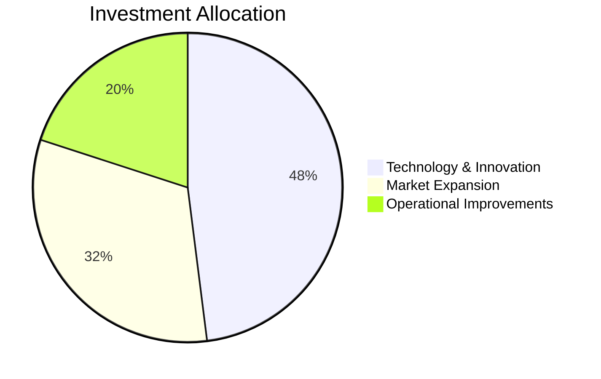
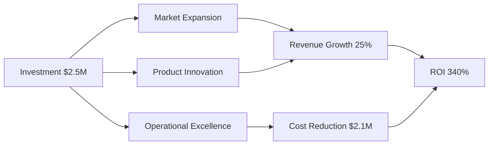
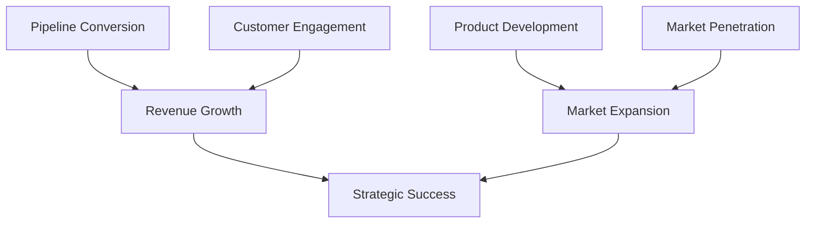
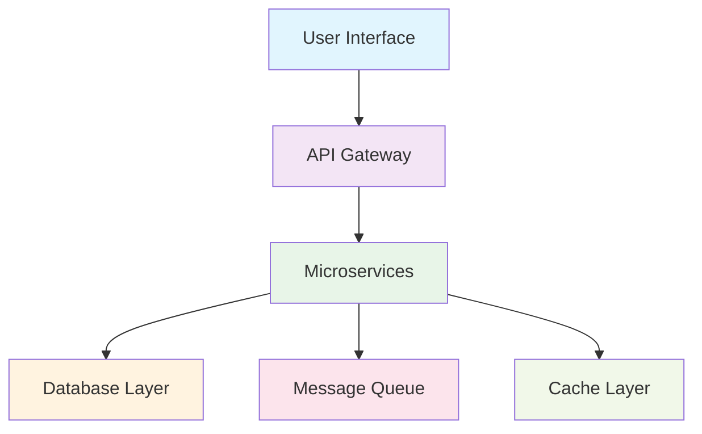

# Strategic Initiative

## Driving Growth Through Innovation

### Executive Presentation
#### Company Name | Q3 2024

---
layout: default
---

# Executive Summary

## Strategic Objective
Transform our market position through strategic initiatives that deliver sustainable competitive advantage and measurable business value.

## Key Outcomes
- **Market Leadership**: Strengthen position in core segments
- **Revenue Growth**: Achieve 25% YoY growth target  
- **Operational Excellence**: Improve efficiency by 30%
- **Innovation Pipeline**: Launch 3 breakthrough products

## Investment Overview

$2.5M

Investment Required

18 months

Timeline

340%

ROI

---
layout: section
background: '#1e40af'
class: text-white
---

# Current Market Position

---
layout: default
---

# Industry Landscape

$12.4B

Total Market Size

15%

Our Market Share

23%

YoY Growth Rate

## Competitive Analysis

| Company | Market Share | Growth Rate | Key Strengths |
|---------|-------------|-------------|---------------|
| **Our Company** | **15%** | **18%** | Innovation, Customer Service |
| Competitor A | 28% | 12% | Scale, Distribution |
| Competitor B | 22% | 15% | Technology, Partnerships |
| Competitor C | 18% | 8% | Cost Leadership |

---
layout: section
background: '#f59e0b'
class: text-white
---

# Strategic Priorities

---
layout: default
---

# Strategic Focus Areas

## Priority 1: Market Expansion
**Objective**: Enter 3 new geographic markets  
**Investment**: $800K | **Timeline**: 12 months | **Expected Revenue**: $3.2M

## Priority 2: Product Innovation
**Objective**: Launch next-generation product line  
**Investment**: $1.2M | **Timeline**: 15 months | **Expected Revenue**: $5.8M

## Priority 3: Operational Excellence
**Objective**: Streamline operations and reduce costs  
**Investment**: $500K | **Timeline**: 8 months | **Cost Savings**: $2.1M annually

---
layout: section
background: '#059669'
class: text-white
---

# Financial Projections

---
layout: two-cols
---

# Revenue Growth Trajectory

| Year | Current Revenue | Projected Revenue | Growth % |
|------|----------------|-------------------|----------|
| 2024 | $45.2M | $56.5M | 25% |
| 2025 | $56.5M | $73.5M | 30% |
| 2026 | $73.5M | $91.9M | 25% |

## Investment Breakdown

::right::

## ROI Analysis

<h3 class="font-semibold text-green-800">Break-even Point</h3>

Month 14

<h3 class="font-semibold text-blue-800">3-Year NPV</h3>

$8.7M

<h3 class="font-semibold text-purple-800">IRR</h3>

42%

## Financial Growth Model

---
layout: section
background: '#dc2626'
class: text-white
---

# Risk Assessment & Mitigation

---
layout: default
---

# High-Priority Risks

## Market Competition
**Risk**: New entrants with disruptive technology  
**Impact**: High | **Probability**: Medium  
**Mitigation**: Accelerate R&D investment and strategic partnerships

## Regulatory Changes
**Risk**: Potential policy shifts affecting operations  
**Impact**: Medium | **Probability**: Low  
**Mitigation**: Engage with regulators and develop compliance frameworks

## Supply Chain Disruption
**Risk**: Global supply chain vulnerabilities  
**Impact**: High | **Probability**: Medium  
**Mitigation**: Diversify suppliers and build strategic inventory reserves

<h3 class="font-semibold text-blue-800">Monthly Reviews</h3>

Risk assessment monitoring

<h3 class="font-semibold text-green-800">Quarterly Updates</h3>

Mitigation strategy refinement

<h3 class="font-semibold text-purple-800">Real-time Dashboard</h3>

Market intelligence tracking

---
layout: section
background: '#059669'
class: text-white
---

# Market Opportunities

---
layout: default
---

# Emerging Opportunities

## Digital Transformation
**Opportunity**: Growing demand for digital solutions  
**Market Size**: $2.8B by 2026 | **Our Addressable**: $420M  
**Growth Rate**: 28% annually

## Sustainability Focus
**Opportunity**: Increased ESG requirements driving demand  
**Market Size**: $1.9B by 2025 | **Our Addressable**: $285M  
**Regulatory Support**: Strong government incentives

## International Expansion
**Opportunity**: Untapped markets in Asia-Pacific  
**Market Size**: $3.2B currently | **Growth Rate**: 35% annually  
**Barriers to Entry**: Moderate with local partnerships

## Competitive Advantages

92%

Customer Retention Rate

15

Patents in Portfolio

10+ years

Leadership Experience

---
layout: section
background: '#7c3aed'
class: text-white
---

# Implementation Roadmap

---
layout: default
---

# Strategic Implementation Phases

## Phase 1: Foundation (Months 1-6)

- Establish project governance structure
- Complete market research and competitive analysis
- Begin technology development initiatives

- Hire key personnel and build teams
- Secure regulatory approvals
- Establish vendor relationships

## Phase 2: Execution (Months 7-12)

- Launch pilot programs in target markets
- Complete MVP development and testing
- Implement operational improvements

- Establish strategic partnerships
- Scale marketing and sales efforts
- Monitor early performance metrics

## Phase 3: Scale (Months 13-18)

- Full market rollout and expansion
- Product launch and commercialization
- Optimize operations based on learnings

- Measure and report on KPIs
- Prepare for next phase of growth
- Document lessons learned

---
layout: default
---

# Success Metrics & KPIs

## Financial Metrics

<h3 class="font-semibold text-green-800">Revenue Growth</h3>

25% YoY target

<h3 class="font-semibold text-blue-800">Market Share</h3>

15% → 22%

<h3 class="font-semibold text-purple-800">Profit Margin</h3>

18% → 24%

<h3 class="font-semibold text-orange-800">Customer Acquisition Cost</h3>

20% reduction

## Operational Metrics

<h3 class="font-semibold text-teal-800">Time to Market</h3>

40% reduction

<h3 class="font-semibold text-indigo-800">Customer Satisfaction</h3>

>90% score

<h3 class="font-semibold text-pink-800">Employee Engagement</h3>

Top quartile

<h3 class="font-semibold text-gray-800">Process Efficiency</h3>

30% improvement

## Leading Indicators Dashboard

---
layout: section
background: '#1e40af'
class: text-white
---

# Resource Requirements

---
layout: default
---

# Human Resources & Infrastructure

## Human Resources

<h3 class="font-semibold text-blue-800">Project Leadership</h3>

1 VP, 3 Directors

<h3 class="font-semibold text-green-800">Technical Team</h3>

12 engineers, 4 designers

<h3 class="font-semibold text-purple-800">Market Expansion</h3>

8 sales, 4 marketing professionals

<h3 class="font-semibold text-orange-800">Support Functions</h3>

6 operations, 2 finance specialists

## Technology Infrastructure

<h3 class="font-semibold text-gray-800">Cloud Platform</h3>

$150K annually

<h3 class="font-semibold text-teal-800">Development Tools</h3>

$75K for licenses

<h3 class="font-semibold text-red-800">Security & Compliance</h3>

$100K investment

<h3 class="font-semibold text-indigo-800">Analytics & Monitoring</h3>

$50K solutions

## External Partnerships

<h3 class="font-semibold text-gray-800">Strategic Consulting</h3>

$200K

<h3 class="font-semibold text-gray-800">Technology Partners</h3>

$300K

<h3 class="font-semibold text-gray-800">Market Research</h3>

$100K

---
layout: section
background: '#059669'
class: text-white
---

# Action Items & Next Steps

---
layout: default
---

# Implementation Timeline

## Immediate (Next 30 Days)
- Board approval for strategic initiative funding
- Finalize leadership team appointments  
- Complete detailed project charter and governance framework
- Establish project management office

## Short-term (Next 90 Days)
- Execute market research and competitive intelligence
- Begin recruitment for key positions
- Establish vendor relationships and partnerships
- Develop detailed project plans and timelines

## Medium-term (Next 6 Months)
- Launch pilot programs and gather initial market feedback
- Complete technology development milestones
- Implement operational improvements and measure impact
- Regular progress reviews and strategy adjustments

## Critical Success Factors

<h3 class="font-semibold text-blue-800">Leadership Commitment</h3>

Executive sponsorship

<h3 class="font-semibold text-green-800">Resource Allocation</h3>

Dedicated teams

<h3 class="font-semibold text-purple-800">Market Timing</h3>

Strategic advantage

<h3 class="font-semibold text-orange-800">Execution Excellence</h3>

Disciplined delivery

---
layout: default
---

# Questions & Discussion

## Key Decision Points Today

1. **Funding Approval**: $2.5M investment authorization
2. **Timeline Commitment**: 18-month strategic initiative

3. **Resource Allocation**: Team assignments and priorities  
4. **Success Metrics**: Agreement on KPIs and measurement

## Areas for Deep Dive

<h3 class="font-semibold text-blue-800">Market Expansion Strategy</h3>

Geographic priorities and entry methods

<h3 class="font-semibold text-green-800">Technology Development</h3>

Roadmap details and resource needs

<h3 class="font-semibold text-purple-800">Competitive Response</h3>

Scenario planning and mitigation

<h3 class="font-semibold text-orange-800">Risk Management</h3>

Implementation and monitoring

---
layout: cover
background: linear-gradient(45deg, #1e40af 0%, #7c3aed 100%)
class: text-white
---

# Thank You

## Strategic Leadership for Sustainable Growth

### Your Name | Title
#### your.email@company.com | (555) 123-4567

**Next Steps**: Detailed implementation planning session  
**Timeline**: Board decision by [Date]

---
layout: section
background: '#f8fafc'
---

# Appendix: Supporting Data

---
layout: two-cols
---

# Market Research Details

## Industry Analysis
- Growth trends and forecasts
- Customer segmentation analysis  
- Competitive benchmarking data
- Regulatory environment assessment

## Market Sizing
- Total Addressable Market (TAM): $12.4B
- Serviceable Addressable Market (SAM): $4.8B
- Serviceable Obtainable Market (SOM): $1.2B

## Customer Insights
- Buying behavior patterns
- Decision-making criteria
- Price sensitivity analysis
- Channel preferences

::right::

# Financial Models

## Detailed P&L Projections
- Revenue forecasts by segment
- Cost structure optimization
- Margin improvement strategies
- Investment payback analysis

## Cash Flow Analysis
- Monthly cash flow projections
- Working capital requirements
- Capital expenditure planning
- Financing strategy options

## Sensitivity Analysis
- Best/worst case scenarios
- Key assumption testing
- Break-even analysis
- Risk-adjusted returns

---
layout: default
---

# Technical Specifications & Architecture

## System Architecture

## Development Timeline

- **Phase 1**: Architecture & Foundation (Months 1-3)
- **Phase 2**: Core Development (Months 4-9)
- **Phase 3**: Integration & Testing (Months 10-12)
- **Phase 4**: Deployment & Optimization (Months 13-15)

## Technology Stack
- **Frontend**: React, TypeScript, Tailwind CSS
- **Backend**: Node.js, Express, PostgreSQL
- **Infrastructure**: AWS, Docker, Kubernetes
- **Monitoring**: Datadog, Sentry, CloudWatch

---

<!--
Speaker Notes Template

Slide 1 (Title):  
- Set professional, confident tone
- Emphasize strategic importance
- Reference board/executive context
- Mention confidentiality if needed

Slide 2 (Executive Summary):
- Hit key numbers clearly and confidently
- Connect to company's broader strategy
- Address investor/stakeholder interests
- Emphasize ROI and timeline

Slide 3 (Market Position):
- Use data to tell compelling story
- Show both challenges and opportunities
- Position against competitive context
- Build urgency for action

Continue with speaker notes for each slide...

Corporate Presentation Tips:
- Focus on business impact and ROI throughout
- Use data and metrics to support all major claims
- Address risk and mitigation strategies proactively
- Connect every initiative to company's strategic goals
- Prepare for detailed financial and operational questions
- Have backup slides with supporting data ready
- Practice handling challenging questions professionally
- Maintain executive presence and confidence
- Be prepared to discuss implementation details
- Have contingency plans for different scenarios
-->