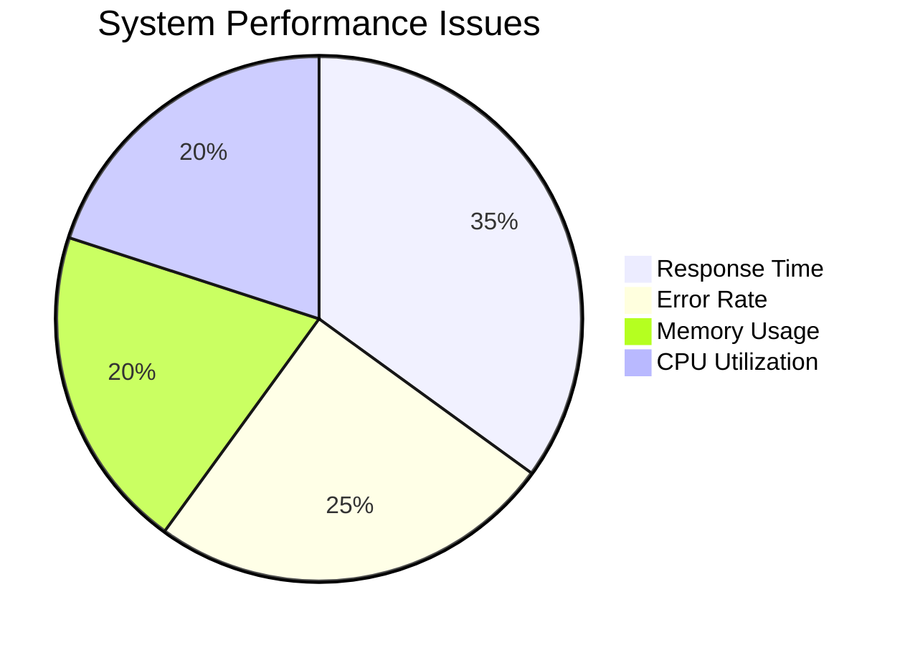
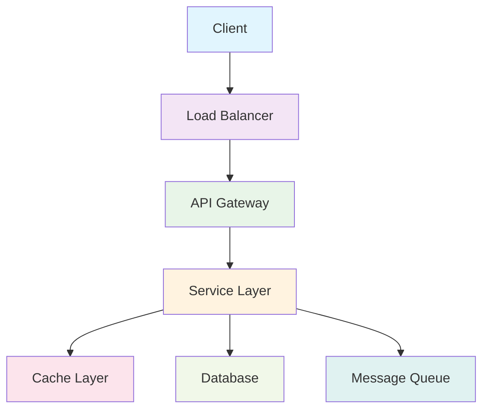
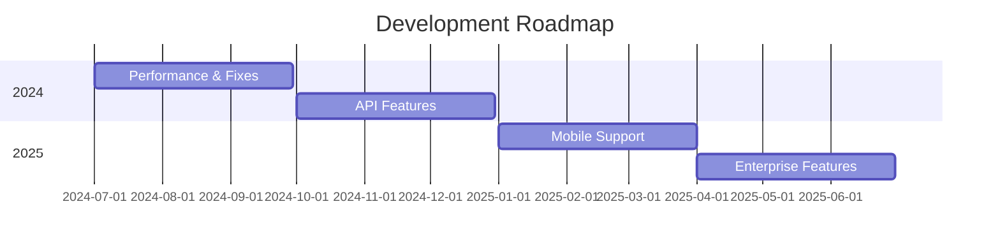

# Technical Presentation Title

## Solving Real Problems with Code

### Your Name | Senior Developer
#### Company/Conference | Date

---
layout: default
---

# About Me

<div class="grid grid-cols-2 gap-8">

<div>

## Professional Background
- **Role**: Senior Software Engineer at Company
- **Experience**: X years in technology/domain
- **Specialties**: List your key technical areas
- **Contact**: @yourhandle | your.email@domain.com

</div>

<div v-click>

## Why This Topic?
- Personal experience with the problem
- Community need or gap identified  
- Lessons learned worth sharing
- Production battle scars to share 🎯

</div>

</div>

---
layout: section
background: '#1e293b'
class: text-white
---

# What We'll Cover

---
layout: default
---

# Technical Deep Dive

<div class="space-y-6">

<div v-click="1" class="flex items-center space-x-4">
<div class="w-12 h-12 bg-red-500 rounded-full flex items-center justify-center text-white font-bold text-xl">1</div>
<div class="text-xl">**The Problem** - Real-world challenge we're solving</div>
</div>

<div v-click="2" class="flex items-center space-x-4">
<div class="w-12 h-12 bg-blue-500 rounded-full flex items-center justify-center text-white font-bold text-xl">2</div>
<div class="text-xl">**Architecture** - System design and approach</div>
</div>

<div v-click="3" class="flex items-center space-x-4">
<div class="w-12 h-12 bg-green-500 rounded-full flex items-center justify-center text-white font-bold text-xl">3</div>
<div class="text-xl">**Implementation** - Code walkthrough and key concepts</div>
</div>

<div v-click="4" class="flex items-center space-x-4">
<div class="w-12 h-12 bg-purple-500 rounded-full flex items-center justify-center text-white font-bold text-xl">4</div>
<div class="text-xl">**Demo** - Live demonstration of the solution</div>
</div>

<div v-click="5" class="flex items-center space-x-4">
<div class="w-12 h-12 bg-yellow-500 rounded-full flex items-center justify-center text-white font-bold text-xl">5</div>
<div class="text-xl">**Lessons Learned** - What worked, what didn't</div>
</div>

</div>

---
layout: section
background: '#dc2626'
class: text-white
---

# The Problem

---
layout: default
---

# Current State of Affairs

<div class="space-y-6">

<div v-click="1">

## The Problematic Approach

```javascript {all|1-3|4-8|9-12|all}
// Example of problematic code or approach
function inefficientSolution(data) {
  // This approach has issues...
  for (let i = 0; i < data.length; i++) {
    for (let j = 0; j < data.length; j++) {
      // O(n²) complexity - not scalable
      processData(data[i], data[j]);
    }
  }
  // No error handling, no caching, no optimization
  return results;
}
```

</div>

<div v-click="2" class="grid grid-cols-3 gap-4 mt-8">

<div class="p-4 bg-red-50 border border-red-200 rounded-lg">
<h3 class="text-red-800 font-semibold">⚡ Performance Issues</h3>
<p class="text-red-700">Slow execution at scale</p>
</div>

<div class="p-4 bg-orange-50 border border-orange-200 rounded-lg">
<h3 class="text-orange-800 font-semibold">🔧 Maintainability</h3>
<p class="text-orange-700">Difficult to extend or modify</p>
</div>

<div class="p-4 bg-yellow-50 border border-yellow-200 rounded-lg">
<h3 class="text-yellow-800 font-semibold">😤 Developer Experience</h3>
<p class="text-yellow-700">Frustrating to work with</p>
</div>

</div>

</div>

---
layout: quote
author: "Production Engineer"
---

"Our deployment process took 45 minutes and failed 30% of the time. Developers were spending more time debugging deployments than writing features."

---
layout: default
---

# Real-World Impact

<div class="grid grid-cols-2 gap-8">

<div>

## Key Challenges

<div class="space-y-4">

<div v-click="1" class="p-4 bg-gray-50 rounded-lg">
<h3 class="font-semibold text-gray-800">📊 Scale</h3>
<p class="text-gray-600">Handling 10M+ requests per day</p>
</div>

<div v-click="2" class="p-4 bg-gray-50 rounded-lg">
<h3 class="font-semibold text-gray-800">🔒 Reliability</h3>
<p class="text-gray-600">99.9% uptime requirement</p>
</div>

<div v-click="3" class="p-4 bg-gray-50 rounded-lg">
<h3 class="font-semibold text-gray-800">👥 Team Productivity</h3>
<p class="text-gray-600">20+ developers contributing</p>
</div>

<div v-click="4" class="p-4 bg-gray-50 rounded-lg">
<h3 class="font-semibold text-gray-800">⚰️ Technical Debt</h3>
<p class="text-gray-600">Legacy systems integration</p>
</div>

</div>

</div>

<div v-click="5">

## Impact Metrics



</div>

</div>

---
layout: section
background: '#059669'
class: text-white
---

# Our Solution Approach

---
layout: two-cols
---

# Design Principles

<div class="space-y-6">

<div v-click="1">

## Core Values
- **Simplicity**: Easy to understand and maintain
- **Performance**: Optimized for real-world usage
- **Reliability**: Fault-tolerant and resilient
- **Developer Experience**: Joy to work with

</div>

<div v-click="2">

## Technical Decisions
- Async/await for better concurrency
- LRU caching for frequently accessed data
- Circuit breaker pattern for resilience
- Comprehensive monitoring and logging

</div>

</div>

::right::

<div v-click="3">

## High-Level Architecture



</div>

---
layout: section
background: '#1e40af'
class: text-white
---

# Implementation

---
layout: default
---

# Core Algorithm

<div v-click="1">

## The Optimized Solution

```python {all|1-3|5-8|10-20|22-25|all}
class OptimizedProcessor:
    def __init__(self):
        self.cache = LRUCache(maxsize=1000)
        self.pool = ThreadPoolExecutor(max_workers=4)
    
    async def process_data(self, data_stream):
        """
        Process data with O(n) complexity and caching
        """
        results = []
        
        async for batch in self.batch_data(data_stream, size=100):
            # Parallel processing with caching
            futures = [
                self.pool.submit(self._process_item, item)
                for item in batch if not self._in_cache(item)
            ]
            
            batch_results = await asyncio.gather(*futures)
            results.extend(batch_results)
            
        return results
    
    def _in_cache(self, item):
        return self.cache.get(item.id) is not None
```

</div>

---
layout: two-cols
---

# Key Features

## Caching Strategy

```python {all|1|2-4|all}
@functools.lru_cache(maxsize=128)
def expensive_computation(input_data):
    # Cache results of expensive operations
    result = complex_algorithm(input_data)
    return result
```

## Database Optimization

```sql {all|1-2|3-5|6-8|all}
-- Optimized query with proper indexing
CREATE INDEX CONCURRENTLY idx_user_activity 
ON user_events (user_id, event_date);

-- Efficient data retrieval
SELECT * FROM user_events 
WHERE user_id = $1 AND event_date >= $2
ORDER BY event_date DESC LIMIT 100;
```

::right::

## Error Handling

```python {all|1-2|3-7|8-12|13-15|all}
async def resilient_api_call(url, retries=3):
    for attempt in range(retries):
        try:
            async with aiohttp.ClientSession() as session:
                async with session.get(url, timeout=10) as response:
                    if response.status == 200:
                        return await response.json()
        except (aiohttp.ClientError, asyncio.TimeoutError) as e:
            logger.warning(f"Attempt {attempt + 1} failed: {e}")
            if attempt == retries - 1:
                raise
            # Exponential backoff
            await asyncio.sleep(2 ** attempt)
    
    raise Exception("Max retries exceeded")
```

---
layout: cover
background: linear-gradient(45deg, #667eea 0%, #764ba2 100%)
class: text-white
---

# Demo Time! 🚀

---
layout: default
---

# Live Demonstration

<div class="grid grid-cols-2 gap-8">

<div>

## Before Optimization

<div class="p-6 bg-red-50 border border-red-200 rounded-lg">

### Processing 10,000 records

- ⏱️ **Time**: ~45 seconds
- 💾 **Memory**: 2.3GB peak  
- ❌ **Success rate**: 87%
- 😞 **Developer happiness**: Low

</div>

</div>

<div v-click>

## After Optimization

<div class="p-6 bg-green-50 border border-green-200 rounded-lg">

### Same 10,000 records

- ⚡ **Time**: ~3.2 seconds **(14x faster!)**
- 🎯 **Memory**: 180MB peak **(12x less)**
- ✅ **Success rate**: 99.8%
- 🎉 **Developer happiness**: High

</div>

</div>

</div>

<div v-click class="mt-8">

## Key Improvements

<div class="grid grid-cols-4 gap-4">

<div class="p-4 bg-blue-50 rounded-lg text-center">
<div class="text-2xl font-bold text-blue-600">O(n²) → O(n log n)</div>
<div class="text-sm text-blue-800">Algorithm optimization</div>
</div>

<div class="p-4 bg-green-50 rounded-lg text-center">
<div class="text-2xl font-bold text-green-600">4 cores</div>
<div class="text-sm text-green-800">Parallel processing</div>
</div>

<div class="p-4 bg-purple-50 rounded-lg text-center">
<div class="text-2xl font-bold text-purple-600">90% hit rate</div>
<div class="text-sm text-purple-800">Smart caching</div>
</div>

<div class="p-4 bg-orange-50 rounded-lg text-center">
<div class="text-2xl font-bold text-orange-600">99.8% success</div>
<div class="text-sm text-orange-800">Better error handling</div>
</div>

</div>

</div>

---
layout: default
---

# Performance Results

<div class="space-y-8">

<div v-click="1">

## Benchmarks

| Metric | Before | After | Improvement |
|--------|--------|-------|-------------|
| Response Time | 450ms | 32ms | **14x faster** |
| Throughput | 100 RPS | 1,500 RPS | **15x higher** | 
| Memory Usage | 2.3GB | 180MB | **87% reduction** |
| Error Rate | 13% | 0.2% | **98% improvement** |

</div>

<div v-click="2">

## Production Impact

<div class="grid grid-cols-3 gap-6">

<div class="p-6 bg-gradient-to-br from-blue-50 to-blue-100 rounded-lg">
<h3 class="font-semibold text-blue-800">👨‍💻 Developer Happiness</h3>
<p class="text-blue-700">Deployment anxiety → confidence</p>
</div>

<div class="p-6 bg-gradient-to-br from-green-50 to-green-100 rounded-lg">
<h3 class="font-semibold text-green-800">💰 Business Impact</h3>
<p class="text-green-700">$2M/year in operational savings</p>
</div>

<div class="p-6 bg-gradient-to-br from-purple-50 to-purple-100 rounded-lg">
<h3 class="font-semibold text-purple-800">🎯 User Experience</h3>
<p class="text-purple-700">Page load times improved 60%</p>
</div>

</div>

</div>

</div>

---
layout: section
background: '#7c3aed'
class: text-white
---

# Lessons Learned

---
layout: two-cols
---

# What Worked Well ✅

<div class="space-y-4">

<div v-click="1" class="p-4 bg-green-50 border-l-4 border-green-400">
<h3 class="font-semibold text-green-800">Start Simple</h3>
<p class="text-green-700">Basic solution first, optimize later</p>
</div>

<div v-click="2" class="p-4 bg-blue-50 border-l-4 border-blue-400">
<h3 class="font-semibold text-blue-800">Measure Everything</h3>
<p class="text-blue-700">Profiling revealed the real bottlenecks</p>
</div>

<div v-click="3" class="p-4 bg-purple-50 border-l-4 border-purple-400">
<h3 class="font-semibold text-purple-800">Incremental Deployment</h3>
<p class="text-purple-700">Feature flags enabled safe rollouts</p>
</div>

<div v-click="4" class="p-4 bg-indigo-50 border-l-4 border-indigo-400">
<h3 class="font-semibold text-indigo-800">Team Collaboration</h3>
<p class="text-indigo-700">Pair programming caught edge cases</p>
</div>

</div>

::right::

# What Didn't Work ❌

<div class="space-y-4">

<div v-click="5" class="p-4 bg-red-50 border-l-4 border-red-400">
<h3 class="font-semibold text-red-800">Overengineering</h3>
<p class="text-red-700">First attempt was too complex</p>
</div>

<div v-click="6" class="p-4 bg-orange-50 border-l-4 border-orange-400">
<h3 class="font-semibold text-orange-800">Ignoring Edge Cases</h3>
<p class="text-orange-700">Production data was messier than expected</p>
</div>

<div v-click="7" class="p-4 bg-yellow-50 border-l-4 border-yellow-400">
<h3 class="font-semibold text-yellow-800">Skipping Documentation</h3>
<p class="text-yellow-700">Onboarding new team members was difficult</p>
</div>

<div v-click="8" class="p-4 bg-pink-50 border-l-4 border-pink-400">
<h3 class="font-semibold text-pink-800">Assuming User Behavior</h3>
<p class="text-pink-700">Real usage patterns were different</p>
</div>

</div>

---
layout: default
---

# Key Takeaways

<div class="grid grid-cols-2 gap-8">

<div>

## Technical Insights

<div class="space-y-3">

<div v-click="1" class="flex items-start space-x-3">
<div class="w-8 h-8 bg-blue-500 rounded-full flex items-center justify-center text-white font-bold text-sm">1</div>
<div>**Profile Before Optimizing**: Assumptions are often wrong</div>
</div>

<div v-click="2" class="flex items-start space-x-3">
<div class="w-8 h-8 bg-green-500 rounded-full flex items-center justify-center text-white font-bold text-sm">2</div>
<div>**Consider the Full Stack**: Frontend optimizations matter too</div>
</div>

<div v-click="3" class="flex items-start space-x-3">
<div class="w-8 h-8 bg-red-500 rounded-full flex items-center justify-center text-white font-bold text-sm">3</div>
<div>**Design for Failure**: Things will break in production</div>
</div>

<div v-click="4" class="flex items-start space-x-3">
<div class="w-8 h-8 bg-purple-500 rounded-full flex items-center justify-center text-white font-bold text-sm">4</div>
<div>**Developer Experience Matters**: Tools should bring joy</div>
</div>

</div>

</div>

<div>

## Process Insights

<div class="space-y-3">

<div v-click="5" class="flex items-start space-x-3">
<div class="w-8 h-8 bg-orange-500 rounded-full flex items-center justify-center text-white font-bold text-sm">1</div>
<div>**Start with User Needs**: Technology serves the business</div>
</div>

<div v-click="6" class="flex items-start space-x-3">
<div class="w-8 h-8 bg-teal-500 rounded-full flex items-center justify-center text-white font-bold text-sm">2</div>
<div>**Iterate Quickly**: Small, frequent deployments reduce risk</div>
</div>

<div v-click="7" class="flex items-start space-x-3">
<div class="w-8 h-8 bg-indigo-500 rounded-full flex items-center justify-center text-white font-bold text-sm">3</div>
<div>**Measure Impact**: Data-driven decisions beat opinions</div>
</div>

<div v-click="8" class="flex items-start space-x-3">
<div class="w-8 h-8 bg-pink-500 rounded-full flex items-center justify-center text-white font-bold text-sm">4</div>
<div>**Share Knowledge**: Documentation and talks help everyone</div>
</div>

</div>

</div>

</div>

---
layout: section
background: '#059669'
class: text-white
---

# Open Source & Community

---
layout: two-cols
---

# Available Resources

<div class="space-y-6">

<div v-click="1">

## 📦 Code & Documentation
- **GitHub Repository**: `github.com/yourusername/project-name`
- **Documentation**: Comprehensive setup and usage guides
- **Examples**: Real-world use cases and sample code

</div>

<div v-click="2">

## 💬 Community
- **Discord/Slack**: Questions and discussion
- **Issues**: Bug reports and feature requests
- **Discussions**: Architecture and design patterns

</div>

</div>

::right::

<div v-click="3">

## Contributing

```bash
# Get started in 3 commands
git clone https://github.com/yourusername/project-name
cd project-name
npm install && npm start
```

<div class="mt-6 space-y-3">

- ✅ Issues welcome (bug reports, feature requests)
- ✅ Pull requests encouraged (with tests!)
- ✅ Documentation improvements always appreciated
- ✅ Community feedback shapes the roadmap

</div>

</div>

---
layout: default
---

# What's Next?

<div class="grid grid-cols-2 gap-8">

<div>

## Upcoming Features

<div class="space-y-4">

<div v-click="1" class="p-4 bg-blue-50 rounded-lg">
<h3 class="font-semibold text-blue-800">🤖 Version 2.0</h3>
<p class="text-blue-700">Machine learning integration</p>
</div>

<div v-click="2" class="p-4 bg-green-50 rounded-lg">
<h3 class="font-semibold text-green-800">☁️ Cloud Native</h3>
<p class="text-green-700">Kubernetes-ready deployment</p>
</div>

<div v-click="3" class="p-4 bg-purple-50 rounded-lg">
<h3 class="font-semibold text-purple-800">📱 Mobile SDK</h3>
<p class="text-purple-700">React Native and Flutter support</p>
</div>

<div v-click="4" class="p-4 bg-orange-50 rounded-lg">
<h3 class="font-semibold text-orange-800">📊 Analytics Dashboard</h3>
<p class="text-orange-700">Real-time monitoring</p>
</div>

</div>

</div>

<div v-click="5">

## Roadmap



</div>

</div>

---
layout: cover
background: linear-gradient(45deg, #667eea 0%, #764ba2 100%)
class: text-white
---

# Questions & Discussion

## Let's dive deeper together! 🤿

### Thank you for your attention

**Slides**: `slides.yourname.com/tech-talk-2024`  
**Code**: `github.com/yourusername/project`  
**Contact**: `@yourhandle` | `your.email@domain.com`

---
layout: section
background: '#f8fafc'
---

# Bonus Resources

---
layout: two-cols
---

# Learning Materials

## 📚 Books
- "System Design Primer" - Comprehensive overview
- "Clean Architecture" - Robert C. Martin
- "Designing Data-Intensive Applications" - Martin Kleppmann

## 🎓 Courses
- Platform-specific deep dives
- Architecture patterns and practices
- Performance optimization techniques

## 🎧 Podcasts
- "Software Engineering Daily"
- "The Changelog"
- "Engineering Culture"

::right::

# Tools & Libraries

## 🛠️ Development
- VSCode extensions for productivity
- Debugging tools and techniques
- Code quality and linting setups

## 🧪 Testing
- Framework recommendations
- Integration testing strategies
- Performance testing approaches

## 🚀 Deployment
- CI/CD pipeline examples
- Infrastructure as code
- Container orchestration

## 📈 Monitoring
- APM and logging solutions
- Alerting and incident response
- Performance metrics tracking

---

<!--
Speaker Notes Template

Slide 1 (Title):
- Introduce yourself and your background
- Set expectations for technical depth
- Mention there will be live demos
- Ask about audience's experience level

Slide 2 (About Me):
- Keep this brief but establish credibility
- Connect your experience to the topic
- Invite audience to connect afterward
- Mention you'll share contact info at the end

Slide 3 (Agenda):
- Emphasize the hands-on nature
- Mention timing for each section
- Ask about audience's experience level
- Note when questions are most welcome

Technical Presentation Tips:
- Have backup plans for demos (screenshots, recordings)
- Test all code examples beforehand in multiple environments
- Prepare for questions about edge cases and alternatives
- Have monitoring/logs ready to show during demo
- Practice transitions between slides for smooth flow
- Keep water nearby and take brief pauses
- Have contact info ready for follow-up questions

Demo Preparation:
- Test internet connectivity and backup options
- Have local versions of all external dependencies
- Prepare rollback plan if demo fails
- Take screenshots as backup visual aids
- Practice demo timing to fit within allocated slot
-->